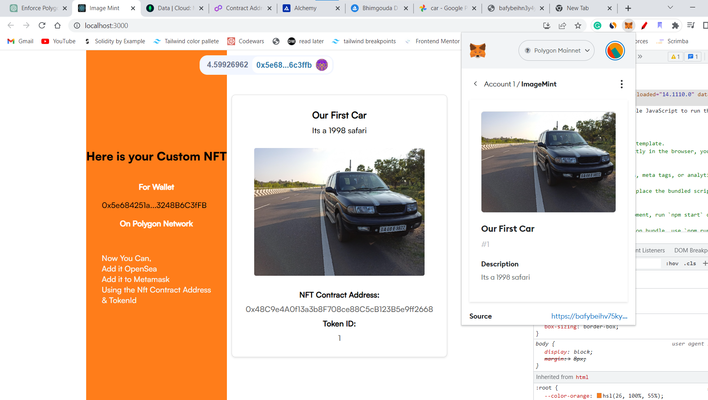

# Image Mint - Create Custom IPFS hosted NFTs in Seconds
Get your own custom-image NFT by just drag and drop of your favorite images

Live website link - https://image-mint.bhim.me

# Decentralized NFT marketplace

[See Live Demo of the dApp](https://www.linkedin.com/posts/bhimgouda-patil-05a254269_solidity-100daysofcode-activity-7065712388225826817-L9JF?utm_source=share&utm_medium=member_desktop)

- Connect Your Web3 Wallet
- Add a Name, description and Pick an Image of your choice.
- Tap the Mint NFT Button 
- Voila!!! You have your Custom NFT
- Now you can Add it to your wallet or list it on NFT marketplaces like Open-sea

### So how does all this work? 🙃 

----------It has 3 main pieces to it---------
1. We send your Image, name and descriptions to our servers
2. Server uploads it to IPFS and gets the IPFS link
3. IPFS link is then send to Our deployed SMART CONTRACT and it mints an NFT for you

Simple right ?!!

[Check Verified Contracts of this dApp on Polygon Mainnet](https://sepolia.etherscan.io/address/0x48C9e4A0f13a3b8F708ce88C5cB123B5e9ff2668)
